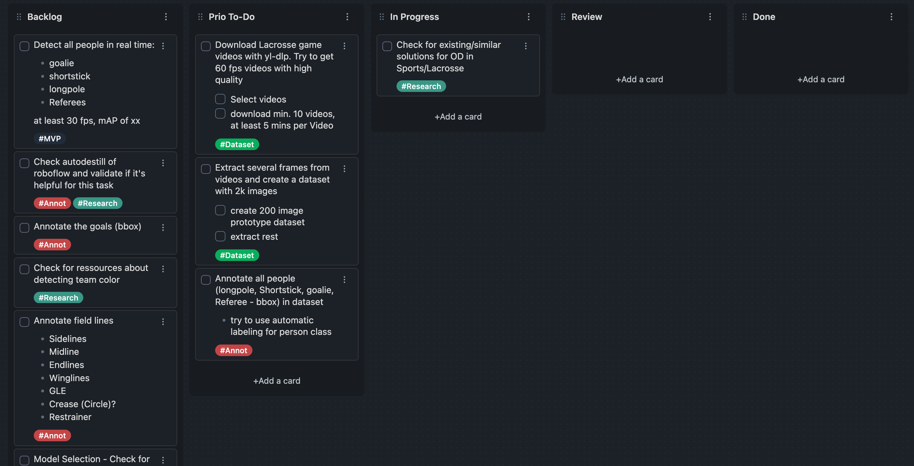
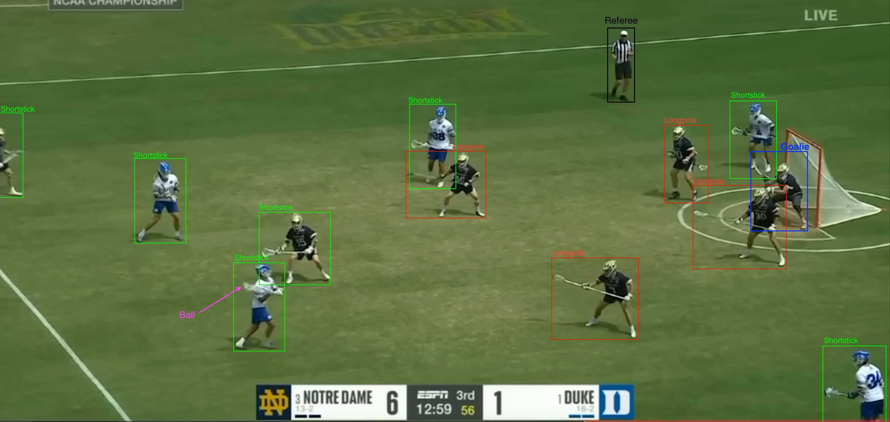

# Lacrosse Object Detection

# Motivation

I recently finished a 6 month internship as an AI Engineer where I started to
learn about computer vision with deep learning. Beforehand I finished two
Udacity courses (Deep Learning and Computer Vision Nanodegree) in that field.
Computer vision captivated me, so that's why I'm starting cv related projects.

Why Lacrosse? I played for several years lacrosse in Germany and simply because
of that I'm starting this project to make a real time lacrosse object detection.
And I also didn't find any solution on my initial search (Object Detection in
sports yes but not for Lacrosse). 

This project will be challenging and will take some time that's why I'll also
try to use some agile project-management approaches. I'm working alone on this 
project so there is no need to overdo it but I will use a kanban board to define
my tasks in a backlog and track my work progress (I'll use obsidian's kanban
plugin). For example that's how I started my board:

# Idea and Concept

## What is the idea, what do I want to achieve?

**MVP**
1. Detect all players (classes: goalie, shortstick, longpole) and Referees in
real time -> Inference on 30 fps videos

**Moonshots**
1. Additionally to the MVP, count and track the players and referees
2. Separate the players in their respective teams
3. Detect/track the Ball and predict the ball carrier (pose estimation via Cradling the ball?)

**Additional objectives**
- Detect the goal and crease (circle around the goal)
- Detect the field lines (sidelines, midline, restrainer, GLE, winglines)
- Detect or predict referee's calls/signs (e.g. goal, time-out etc.)

To get a better understanding of the MVP, look at this image:

I'll create the dataset with [Roboflow](https://universe.roboflow.com/ryseai/lacrosse-object-detection).

Demo GIF Detection to get a short glimpse:

Disclaimer
This project uses images and videos sourced from YouTube (loaded via roboflows UI). I do not claim ownership of any of the content used, and all rights and ownership remain with the original creators and copyright holders. This project is strictly intended for research purposes and is not for commercial use.
